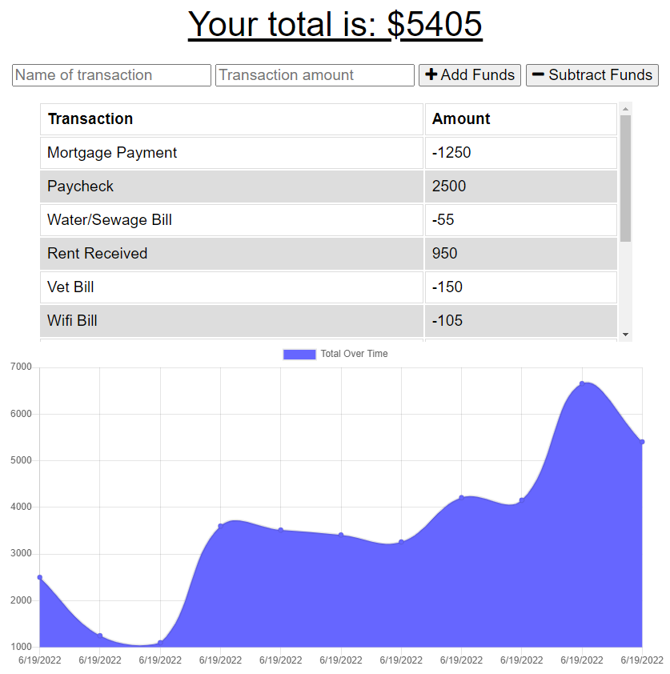

# [PWA Budget Tracker](https://github.com/wwstrothe/pwa-budget-tracker)

## Table of Contents

- [Description](#description)
- [Installation](#installation)
- [Usage](#usage)
- [Screenshot](#screenshot)
- [License](#license)
- [Questions](#questions)

## [Description](#table-of-contents)

This project takes provided starter code for a database enabled budget tracker and converts it into a functional Progressive Web Application (PWA) with offline access and functionality. The browser Cache API is used to store the application's HTML, CSS, and JavaScript, controlled by a service worker. Offline transactions are stored using Indexed DB and are automatically uploaded when a connection is restored. A manifest file is also provided to allow the application to be downloaded to a browser, tablet, or phone.

## [Installation](#table-of-contents)

- npm install

## [Usage](#table-of-contents)

The application is deployed at https://secure-hollows-22505.herokuapp.com/

## [Screenshot](#table-of-contents)

## [License](#table-of-contents)

The application is covered under the following license:

## [Questions](#table-of-contents)

- If you have any questions please [**Email**](mailto:williamstrothe@gmail.com) me
- Check out more of my work at [**GitHub**](https://github.com/wwstrothe)